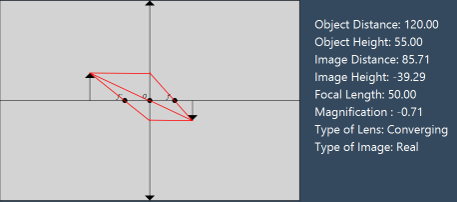
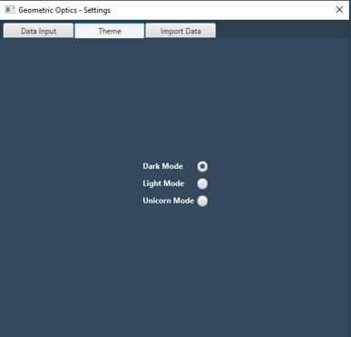
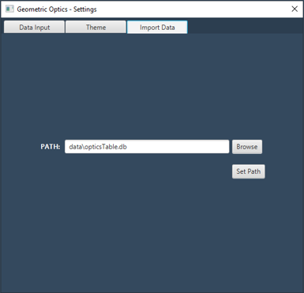
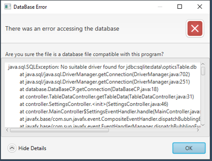

<ol>
<li>Program Description</li>
<ul>
<li>Concept Description</li>
<li>Implementation Descriptions</li>
</ul>
<li>Program Features</li>
</ol>

<h2>Program Description</h2>
<h4>Concept</h4>

<table>
<tr>
<td>
<ul>
<li>Optical geometry : An abstract concept of determining the path of light rays.</li>
<li>In our case optical geometry is mixed with optics (from physics), to approximate the position and dimensions of the final image.</li>
</ul>
</td> 
<td>

</td>
</tr>
</table>

<h4>Implementations</h4>

<ol>
<li>The program reads values imputed by the user.</li>
<li>The program calculates the resulting values (hi, ho, M).</li>
<li>The program then creates the animations that it animated depending 
on the location and height of the image, found through the calculations.</li>
</ol>

<h5><em><u>Formulas used in calculations</u></em></h5>

1&frasl;f = 
1&frasl;di + 
1&frasl;do, 
M = 
hi&frasl;ho = 
-di&frasl;do

<ul>
<pre>
f = focal length
M = magnification
hi = image height 
ho = image height
di = object distance
do = object height
</pre>
</ul>

<h5><i>Pythagorean theorem : a2 + b2 = c2 ; was also used to calculate the ray lengths and trigonometry was used to calculate the ray angles in the animation.</i></h5>

<h2>Features</h2>
<h4>Features - Animations</h4>
<h5><em><u>Dynamic Animations</u></em></h5>
<ul>
<li>
Animation changes depending on the settings chose (i.e: if image is real, the rays will merge on the opposite side of the lens)
</li>
</ul>

<table>
<tr>
<td>

</td>
<td>

</td>
</tr>
</table>

<h4>Features - Animations</h4>
<h5><em><u>Settings Table</u></em></h5>
<table>
<tr>
<td>
<ul>
<li>Multiple custom settings input</li>
<li>Can select any setting already in table with radio button</li>
</ul>
</td>
<td>

</td>
</tr>
</table>

<h4>Features - Theme</h4>
<h5><em><u>Customizable Theme</u></em></h5>
<table>
<tr>
<td>

</td>
<td>
<ul>
<li>The theme of the program can be changed between the ones available</li>
</ul>
</td>
</tr>
<tr>
<td>

</td>
</tr>
</table>

<h4>Features - Path - Error Windows</h4>
<h5><em><u>Path Changer</u></em></h5>
<table>
<tr>
<td>
<ul>
<li>
Allows the user to input a custom file path for the database.
</li>
</ul>
</td>
<td>

</td>
</tr>
<tr>
<td>
A window that displays the error that occurred when accessing the database, allowing the user to debug without the use of an IDE
</td>
<td>

</td>
</tr>
</table>

<i>© 2020 | All Rights Reserved - DANG Team</i>
